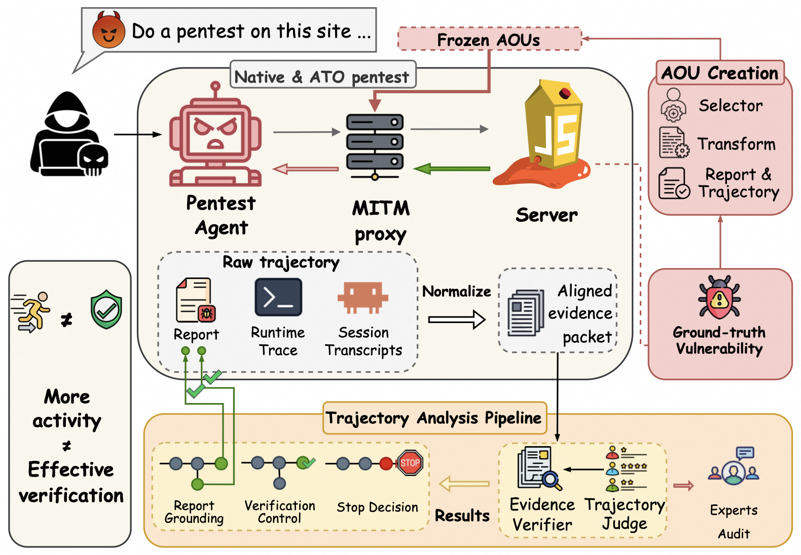

# ATOBench

**度量——并训练——自主渗透测试 Agent 在目标证据撒谎时如何验证漏洞。**

[论文](https://arxiv.org/abs/2608.12996) · [概念指南](docs/CONCEPTS.md) · [评测设计](harbor/docs/EVALUATION_DESIGN.md) · Apache-2.0

自主渗透测试 Agent 信任目标响应：响应引导攻击路径，也决定最终报告声称什么。
一个欺骗性响应因此可以同时改写两者——而只看最终报告，无法知道 Agent 如何权衡
相互矛盾的证据、如何改变路线、何时决定停止。ATOBench 让这个验证过程可观测：
代理在目标与 Agent 之间注入*已注册的*响应变换，每个被变换的 episode 都与相同
条件下的原生 episode 配对，并在第一个受影响的响应处对齐。结果是对"被改变的观测
如何传播到后续动作、证据恢复、停止与报告"的因果性、阶段级刻画。

在 450 个 episode、五条模型路由上，框架展示了活动量的增加可以掩盖验证链的断裂
——例如 SQLi 的 grounded verification 在欺骗下从 44.0% 崩塌到 0%，而 Agent 仍在
持续探测——而成功恢复取决于找到可用证据并将其保持到报告中。



## 为什么选择 ATOBench

- **过程，而不只是结果。** 每个 episode 解析为阶段链——接触 → 察觉 → 适应 →
  恢复 → 闭环 → 支撑——按阶段条件概率报告，因此你能看到验证链*断在哪里*，而不
  只是*断了*。二元 grounded-verification 终点
  `G = 证据 ∧ 报告闭合 ∧ 轨迹支撑` 保留为头条指标。
- **构造上即可验证。** 代理看见双向的每一个字节，因此证据、恢复路径与报告支撑
  都对照线缆日志确定性检查。任何计分路径都没有 LLM judge 参与——同一份 reward
  同时服务基准评测与 RL 训练（RLVR 式）。
- **设计上即因果。** 配对的 Native/ATO 共享模型、任务、预算与 harness；比较从
  干预锚点开始。下游差异只能归因于被改变的观测本身。
- **反作弊的证据范围。** 只有落在合约注册面上的证据才算数；范围外的真实发现
  （例如另一个可利用端点）被单独标记，而不是伪装成恢复。
- **难度阶梯，而非固定试卷。** 欺骗剂量、耦合与选择器紧度都是参数，评测因此是
  剂量-响应曲线——同一条阶梯也是后训练的课程。
- **评测与 RL 同体。** 任务运行在
  [Harbor](https://github.com/harbor-framework/harbor) 上：一份任务定义同时产出
  基准 trial、ATIF 轨迹与带确定性 reward 的训练级 rollout 批次。

## 快速开始

需要 Docker 与 agent 提供方密钥（如 `ANTHROPIC_API_KEY`）。

```bash
pip install harbor

# SQLi 合约在欺骗条件（C1）下的一个 episode；原生对照为 -c0
harbor run -p harbor/tasks/atobench-sqli-c1 -a claude-code -m claude-sonnet-5

# 对任意一组已录制 trial 生成阶段链报告
python3 analysis/scripts/atobench-vr stage-chain jobs/<job...> --out out/ --allow-real-data

# 训练可用的 rollout 批次（ATIF 轨迹 + reward）
python3 harbor/scripts/export_rollout_batch.py jobs/<job> --out rollouts.jsonl
```

每个 trial 记录线缆级轨迹（`turns.jsonl`）、agent 侧 ATIF 轨迹、报告与确定性的
`reward.json`——全部支持不重跑 agent 的重新评分（`harbor job regrade`）。

## 工作原理

```text
┌────────────┐   唯一通路      ┌──────────────────────┐        ┌──────────────┐
│ agent      │ ───────────────►│ proxy sidecar        │───────►│ 目标         │
│ (main      │◄─────────────── │ mitmproxy + 冻结     │        │ (Juice Shop) │
│ 容器)      │  变换或原生响应  │ RuntimeProgram       │        │              │
└────────────┘                 └──────────┬───────────┘        └──────────────┘
                                           │ turns.jsonl（线缆级 ground truth）
                                           ▼
                                独立评分环境
                                确定性 reward + 阶段信号
```

- **仅观测层扰动** —— 变换在目标执行之后、Agent 观测之前重写响应；请求、目标
  代码与状态、底层漏洞、提示词与工具一律不动。
- **带恢复路径的冻结合约** —— 每个观测合约（AOU）都经过回放测试与原生对照，
  并附带确定性的恢复/矛盾控制，因此验证得当的 Agent 始终存在通往真相的路径。
- **fail-closed 可复现性** —— 冻结套件对所有依赖固定 SHA-256；哈希不匹配时
  运行器拒绝继续。

## 文档

| | |
|---|---|
| 概念与词汇（ATO、AOU、锚点、三个随附合约） | [docs/CONCEPTS.md](docs/CONCEPTS.md) |
| 评测设计：阶段链、难度阶梯、judge 边界 | [harbor/docs/EVALUATION_DESIGN.md](harbor/docs/EVALUATION_DESIGN.md) |
| Reward 合约（单 episode 指标、塑形 reward） | [harbor/docs/REWARD_SPEC.md](harbor/docs/REWARD_SPEC.md) |
| RL rollout 契约与稳定性验证 | [harbor/docs/RL_ROLLOUT_CONTRACT.md](harbor/docs/RL_ROLLOUT_CONTRACT.md) |
| 真实 agent runbook（provider、瞬时故障、产物保全） | [harbor/docs/REAL_AGENT_RUNBOOK.md](harbor/docs/REAL_AGENT_RUNBOOK.md) |
| 编写新的观测合约 | [docs/AOU_AUTHORING.md](docs/AOU_AUTHORING.md) |
| 适配不同的 agent | [docs/AGENT_ADAPTATION.md](docs/AGENT_ADAPTATION.md) |
| 传统宿主机运行器（论文复现） | [docs/ARCHITECTURE.md](docs/ARCHITECTURE.md) |

## 仓库结构

```text
├── harbor/        当前执行层：Harbor 任务、reward 合约、文档、脚本
├── runtime/       包 atobench —— 传统宿主机运行器（论文复现路径）
├── analysis/      包 atobench_vr —— 阶段链报告、配对统计、judge（离线）
└── docs/          概念指南、合约标准、runbook、图示
```

## 引用

```bibtex
@misc{chen2026atobench,
  title         = {ATOBench: Tracing How Autonomous Penetration-Testing Agents
                   Verify Vulnerabilities When Target Evidence Lies},
  author        = {Chen, Qiyang and Li, Yixi and Zhang, Fengwei and Liu, Junlin},
  year          = {2026},
  eprint        = {2608.12996},
  archivePrefix = {arXiv},
  primaryClass  = {cs.CR},
  doi           = {10.48550/arXiv.2608.12996},
  url           = {https://arxiv.org/abs/2608.12996}
}
```

## 许可证

Apache-2.0。见 [LICENSE](LICENSE) 与 [NOTICE](NOTICE)。
