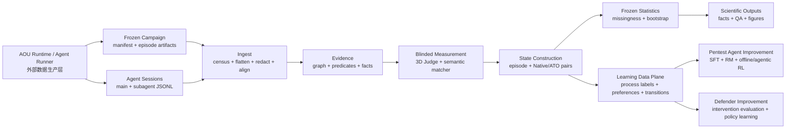

# Architecture

## 分层

核心原则是单向数据流。AOU runtime 不导入分析实现，分析也不控制 agent。两侧
只通过冻结 campaign 和 session/event schema 交换数据。

Scientific Outputs 与 Learning Data Plane 必须是两个明确的出口。前者回答研究
问题并服从冻结统计协议；后者将已审计的轨迹对象投影为训练样本。训练数据导出
不能反向改变科学标签，也不能把模型 Judge 的推测冒充 target-side truth。

## 代码位置

| 路径 | 责任 |
|---|---|
| `src/atobench_vr/` | 可安装的核心分析库 |
| `scripts/` | 编号阶段兼容入口和统一 CLI |
| `config/` | schema、rubric、lock、Judge/semantic 配置 |
| `config/platform/` | 通用 Target/AOU/Profile/Campaign registry、冻结参考与新对象模板 |
| `tests/` | 合成数据、fail-closed 和统计回归测试 |
| `reference/latest/cohort/` | 可复现统计所需的轻量 Stage 20 cohort |
| `reference/latest/results/` | 最新冻结统计、result facts、trajectory outputs |
| `reference/latest/audits/` | JWT 契约修复与统计审计 |
| `reference/latest/learning_data_v1/` | LearningRecord v1、dataset card 与导出审计 |
| `reference/latest/learning_transitions_v1/` | 脱敏 structured transition v1、dataset card 与导出审计 |
| `reference/latest/counterfactual_trajectory_v1/` | 六类 trajectory object、三个消费 view 与导出审计 |
| `reference/latest/platform/` | 验证过的 plan-only campaign freeze lock |
| `workspace/` | 新运行产生的版本化输出；首次运行时创建 |

## 当前测量逻辑

- **Verification Control**：保留 numeric diagnostic。
- **Stop Decision**：descriptor first；numeric score 仅作工程 provenance。
- **Report Grounding**：保留 numeric score proximity，同时由 registered-finding
  semantic matcher 判断 closure 与 trace support。
- **Primary estimand**：AOU-specific Grounded Retention。
- **Missingness**：`state_unavailable` 不折算成失败；报告上下界。
- **Uncertainty**：固定 20,000 次 pair bootstrap，并补 exact binomial interval。
- **禁止项**：不做跨 AOU primary pooled estimate、不做跨维 composite、不做模型
  排名推断、不生成 primary p-value family。

## Stage 17 与 Stage 20 的关系

Stage 17 trajectory dynamics 是探索性行为链分析；Stage 20 是对 JWT registered
finding semantic contract 的测量修复。Stage 20 的 corrected cohort 和统计结果
是当前 canonical reference，Stage 17 的图形语法仍可复用，但不能覆盖 Stage 20
统计真值。

## Stage 18 Learning Data Plane

Stage 18 是只读 projection，不进入 Stage 1–17 的依赖闭环。它消费冻结 facts、
episode states 与 pair profiles，输出三种 `LearningRecord v1` view：

- episode summary；
- typed process label；
- Native/ATO counterfactual pair。

它不能修改上游标签、重跑 Judge 或重新配对。当前 action/observation 内容不在轻量
cohort 中，因此 `trajectory_sft_ready` 和 `offline_transition_ready` 必须保持
false。

## Stage 19 Structured Transition Plane

Stage 19 是同样只读的 graph projection。它读取外部冻结 `graph_nodes.jsonl`，在
每个 action turn 输出 `state_before -> action -> observation/intervention/evidence
-> state_after`。导出采用字段白名单，并把 JSON schema 收缩为无字段名的形状统计；
request/response value、正文、typed value、identity/resource value、raw source
pointer 和自由文本全部排除。它因此可支持结构化 tool-policy/RL 研究，但没有自然
语言上下文，也没有 AOU-specific reward，不能标为直接 SFT/offline RL ready。

## Stage 20 Transition Audit Selection

Stage 20 从已脱敏 transition 中确定性抽取人工审计 packet，按 `AOU × condition`
分层，并追加四种边界覆盖（native observation、evidence、intervention、target-AOU
contact）。packet 中只有闭集 `pass/fail/uncertain` 问题；不收集审计者身份或自由
文本，也不修改 transition 或产生训练 label。它的完成状态只能是
`AWAITING_HUMAN_REVIEW`，直到一个单独授权的人工审计响应流程完成。

## Counterfactual trajectory data product

该层只读消费 Stage 18/19 的冻结导出，构造 Canonical Trajectory、Intervention、
Step Behavior、Decision/Failure Point、Evidence-to-Claim 与 Counterfactual Pair 六类
对象。Replay、Diagnostic、Counterfactual 三个 view 是这些对象的消费者投影。
Decision/Failure Point 只表示可观察边界或确定性候选信号，不声称恢复 Agent 的内部
推理；Judge 诊断也始终与 target-side facts 分层保存。

## Platform scaffold

通用 scaffold 位于 `config/platform/` 和 `src/atobench_vr/platform.py`。它把
Target Adapter、AOU Bundle、Analysis Profile 和 Campaign 显式绑定，并验证每个
外部冻结 artifact 的 SHA-256。当前 `atobench-cross-model-v1` adapter 默认只生成
legacy runner 的 exact dry-run command；平台 AOU ID 在 adapter 边界映射为旧
runner 的 `sqli`、`basket`、`jwt` key。`prepare` 会重新验证 freeze lock 与
artifact，写入 metadata-only handoff；仅
`execute --allow-real-execution --allow-external-artifacts` 能启动 legacy runner，
并会再次检查 handoff/lock/plan 一致性。详见 `docs/PLATFORM_SCAFFOLD.md`。
`init-campaign` 则是配置创建边界：它只接受已经注册且 frozen 的 target/AOU/profile，
现场校验 artifact 并 hash runner；默认生成未登记 manifest，只有 `--register` 才会
更新 registry。它不执行 target 或模型调用。
