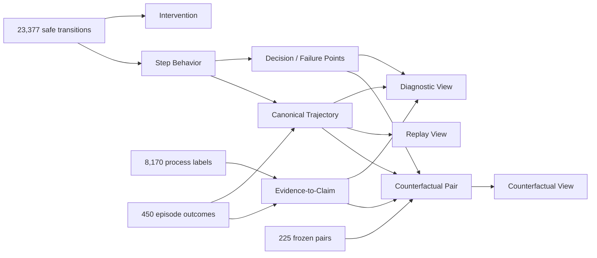

# Counterfactual Verification Trajectory Dataset v1

## 目标

这一层不把轨迹包装成“可直接训练”的故事，而是先产出可验证、可重组的数据对象，
回答三个不同问题：

1. **Replay View**：Agent 实际执行了什么完整动作序列？
2. **Diagnostic View**：哪些可观察边界发生了策略切换、重复、证据更新、AOU 接触或
   终止，证据又如何传播到 claim 与 report？
3. **Counterfactual View**：冻结 Native/ATO pair 在首次可观察 AOU 接触之后从哪里
   分流，行为与最终 verification state 如何变化？

三个 view 只消费六类 canonical object，不创建第二套科学标签。

## 六类对象

| 对象 | 粒度 | 主要来源 | 作用 |
|---|---:|---|---|
| Canonical Trajectory | episode | structured transitions | 完整、有序、可回放的 observable trajectory |
| Intervention Record | turn | intervention + native/visible boundary | 显式记录 AOU 接触及观测边界 |
| Step-Level Behavior Record | action turn | structured transition | action、observation、evidence 与确定性行为标签 |
| Decision / Failure Point | selected turn | deterministic rules | 可观察决策边界和 failure-signal candidate |
| Evidence-to-Claim Record | episode | process labels + episode outcome | evidence → claim → closure → resolution |
| Counterfactual Pair Record | C0/C1 pair | frozen pair + two trajectories | intervention anchor、分支和 effect propagation |

所有对象使用 `atobench.counterfactual_trajectory_object.v1`，并强制携带
`provenance.label_origin`。当前允许的语义来源包括：

- `observed_structured_transition`：安全 transition 中直接可见；
- `deterministic_candidate`：由公开规则确定性生成；
- `judge_derived`：episode-level Judge 诊断；
- `semantic_matcher_derived`：report/claim semantic matcher；
- `registered_contract_derived`：注册 evidence/closure contract；
- `unavailable`：当前安全投影无法可靠恢复。

## 关键设计约束

### 不伪造 Agent 内部决策

“策略切换”表示 action signature 的结构变化；“重复阈值”表示同一 signature 第三次
出现；“终止边界”表示最后一个可观察 action。它们都是行为边界，不是恢复出的
chain-of-thought。记录中的 `internal_reasoning_observed` 永远为 `false`。

### 不伪造 turn-level fact join

LearningRecord 的 deterministic fact 保留了源事件指针，但 safe transition v1 删除了
原始行号，无法可靠做 exact turn join。v1 因而把 fact 放在 episode-level
Evidence-to-Claim Record，并显式写入
`turn_level_fact_linkage=unavailable_in_safe_transition_v1`。step 层只使用其本身已有的
evidence event。

### Counterfactual 不等于 preference

C0/C1 的 observation 本来就不同。v1 在 C1 首次 target-AOU contact 处建立 anchor，
用动作序号做保守对齐，再报告 post-anchor action signature divergence。该对象适合诊断、
数据选择与未来 reward/skill/memory 研究，不是可直接用于 DPO 的 same-input preference。

## 数据流



## 实施阶段

### Phase 1：数据产品层

- 统一 schema、稳定 object ID、source record provenance；
- 六类 JSONL object 与三个轻量 view；
- 全局引用完整性、路径泄漏、敏感残留与 overwrite fail-closed audit；
- dataset manifest、dataset card、quality summary；
- 对现有 reference bundle 的无模型、无网络确定性导出。

### Phase 2：TraceLens 消费层

- Reference 接入优先识别 `counterfactual_trajectory_v1`；
- Replay 页面只读取完整 timeline；
- Diagnostic 页面将 decision candidates 与 Judge/evidence 来源视觉分层；
- Counterfactual 页面以 contact anchor 为中心展开 C0/C1，而不是把两个 run 画成一条线；
- 原有 transition adapter 保留为旧 bundle fallback。

### Phase 3：质量验证

- 对 decision/failure candidate 做分层人工审计；
- 有授权时从 graph source 增加 exact fact-to-turn join；
- 增加多 target held-out 数据；
- 仅在 reward contract 与 downstream experiment 冻结后，另行构造 SFT/RL 数据，
  不反向修改本数据集的事实层。

## 导出

```bash
python3 scripts/atobench-vr export-counterfactual-trajectories \
  --transitions reference/latest/learning_transitions_v1/transition_records.jsonl \
  --episodes reference/latest/learning_data_v1/episode_records.jsonl \
  --process-labels reference/latest/learning_data_v1/process_label_records.jsonl \
  --pairs reference/latest/learning_data_v1/counterfactual_pair_records.jsonl \
  --output workspace/counterfactual-trajectory-v1 \
  --allow-real-data
```

完成目录不可覆盖；重新导出必须使用新目录。导出不调用模型，也不访问网络。
