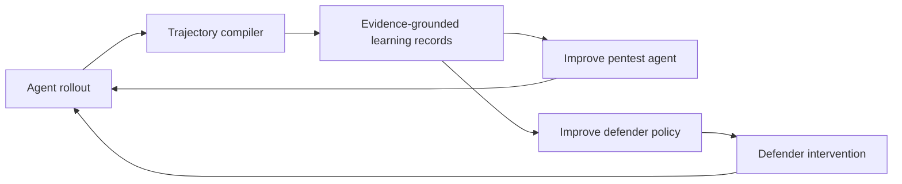

# Project vision and learning-data direction

## 一句话定位

ATOBench Verification Resilience 是一个面向 cyber agents 与 adaptive
defenders 的 **evidence-grounded trajectory compiler**：它把长时程、异构、难以
审计的 agent–environment 交互，转换为可解释、可比较、可复现，并最终可用于
训练的数据。

这比“轨迹分析工具”更深一层。轨迹分析是入口，学习数据基础设施才是长期价值。

## 为什么这个问题重要

Agent long-horizon 能力的瓶颈不只在模型和算法，也在数据。最终报告或二元成功
标签只告诉我们结果，无法回答：

- agent 是否接触到关键观察；
- 是否采用了观察中的信息；
- 是否获得独立证据；
- 观察受干预后是否复探、换路或恢复；
- 是否在证据不足时过早停止；
- 最终报告是否忠实反映 target-side trace。

没有这些中间结构，后训练很容易奖励偶然成功、无证据断言、无效重复，或者把
“更多动作”误认为“更强能力”。本项目要提供的是经过证据绑定的过程数据，而不
只是更多日志。

## 双边价值

### 1. Pentest agent learning

数据可用于提升：

- 目标接触与信息获取；
- 证据验证和独立交叉检查；
- 受阻后的恢复、替代路径与工具重配置；
- calibrated stopping；
- report grounding；
- 长时程 credit assignment。

潜在训练产品包括：

- **SFT trajectories**：经审计的高质量验证与恢复片段；
- **preference pairs**：同任务下 grounded 与 ungrounded、有效恢复与无效重复；
- **process-reward records**：在接触、采用、验证、恢复、停止、报告节点上的局部标签；
- **offline RL transitions**：可观察 state、action、observation、evidence-state 转移；
- **hard negatives**：表面成功但证据不闭合、报告正确但过程不可靠的反例；
- **curricula**：按 AOU、干预强度、恢复深度和证据缺口分层的任务序列。

### 2. Defender learning

同一数据也可以服务 defender：

- 比较哪些 observation-layer interventions 能被 agent 接触、采用或抵抗；
- 识别 deception 在哪个行为阶段有效或失效；
- 区分短暂误导、持续控制与触发更强验证行为；
- 训练或优化 intervention-selection policy；
- 构造针对不同 agent/model/scaffold 的自适应防御 curriculum；
- 评估 defender 提升是否依赖伪造不可接受的安全事实。

因此这是一个双边学习闭环：



## 本项目真正独特的数据资产

普通日志系统记录“发生了什么”。本项目额外提供：

1. action、observation、intervention 与 target event 的对齐；
2. target-side evidence 与 agent-side claim 的分离；
3. typed evidence/dependency graph；
4. registered finding 和 AOU-specific verification contract；
5. Native C0 / ATO C1 的冻结配对；
6. missingness-aware 状态，不把 unavailable 偷换成 failure；
7. 可追溯到原始行、文件哈希、runtime/AOU 版本的 provenance；
8. Judge、deterministic predicate、human label 的证据等级分离。

尤其是 C0/C1 配对，使数据比普通成功轨迹更接近可用于学习的反事实监督：同一任务
单元在自然观察和受控干预下，能力链在哪一步发生变化。

## LearningRecord v1 已实现，但不能直接宣称“已经 RL-ready”

当前框架已经冻结 learning-data export contract，并从 Stage 20 reference 导出
8,845 条 episode、process label、counterfactual pair records；此外已从冻结 graph
导出一层 `structured_transition`。后者在每个 tool-call boundary 上提供
state-before、action metadata、native/visible observation metadata、intervention、
evidence 与 state-after，但只保留白名单结构，不含 request/response value、正文、
身份/资源值、原始路径或自由文本。

但分析数据变成可直接训练的数据前还必须解决：

- label provenance 与置信等级；
- reward hacking 和 outcome leakage；
- target、AOU、snapshot、template 级 train/eval 隔离；
- 重复轨迹与近重复报告去重；
- model-Judge 标签不能冒充环境真值；
- 不采集或发布隐藏 chain-of-thought，只使用可观察 action、tool call、observation
  和 final report；
- offensive-agent 与 defender-policy 数据集分开授权、分开发布；
- 敏感目标、secret 和真实身份信息的 redaction 与 release gate。

所以准确表述应是：**当前版本实现了经过审计的 RL-data substrate 和安全的结构化
transition layer；下一阶段冻结 AOU-specific reward mapping，并验证其是否真正改善
cyber-agent 的证据闭环能力。**

## 建议的 Learning Record v1

每个训练单元至少应包含：

```text
record_id
task_id / pair_id / episode_id
target_snapshot / aou_version / runtime_hash
condition and intervention exposure
observable state summary
action and tool-call class
observation reference
target-side evidence state before and after
verification / recovery / stop / report labels
label source and confidence
source pointers and hashes
split assignment
allowed training uses
```

在此基础上派生四类 view：

| View | 训练用途 | 核心监督 |
|---|---|---|
| `trajectory_sft` | 行为模仿 | 经审计的动作序列与报告 |
| `trajectory_preference` | DPO/RM | 同任务或匹配任务的过程质量比较 |
| `process_reward` | PRM/credit assignment | 局部证据与行为状态转移 |
| `offline_transition` | offline/agentic RL | state–action–observation–next-state |
| `defender_intervention` | defender policy learning | intervention–contact–adoption–recovery–outcome |

## 当前实现与下一阶段

已完成：

1. `LearningRecord v1` schema；
2. 当前 450-episode reference cohort 的只读 exporter；
3. dataset card、manifest、provenance 和 split-leakage audit；
4. 2,338 条 environment-verified process-label candidates；
5. 102 个具有保守 preference candidate 的 Native/ATO pairs。

这些 C0/C1 records 是反事实分析 pair，不是可直接送入 DPO/RM 的 same-input
preference pair。两侧观察内容不同，而且当前 candidate direction 明显偏向 C0；
直接训练会把 condition 差异误当成策略质量。正式 preference data 必须在
action–observation join 后构造 within-condition 或 matched-observation 比较。

下一步：

1. 人工抽检 transition、process labels 与 preference candidates；
2. 冻结 AOU-specific reward mapping，禁止通用 fact polarity reward；
3. 将 deterministic facts 连接到兼容的 step boundary，形成可审核的局部监督；
4. 用小规模后训练实验验证数据是否改善“证据闭环”，而非只提高报告成功率；
5. 为 defender 数据建立独立 objective、policy 和安全发布边界。

最终目标不是替某一种模型或 RL 算法服务，而是形成一个稳定的数据层：新的模型、
agent scaffold、AOU、target 和训练方法都可以复用同一套可审计轨迹语义。
